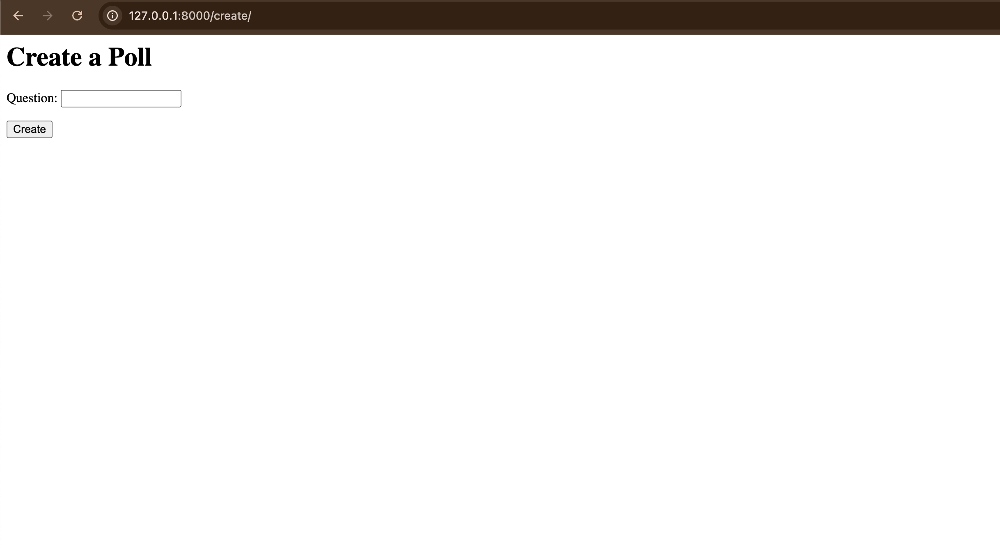

# Polls App

This app creates a small re-usable polls, and use the persistent storage technology to keep them in memory.
These polls store the information regarding which option have been voted up to how many times.

View:

Home Page

Create Poll Page

Add Options Page

Updated Home Page

Voting Page

Result Page

App Flow Diagram
